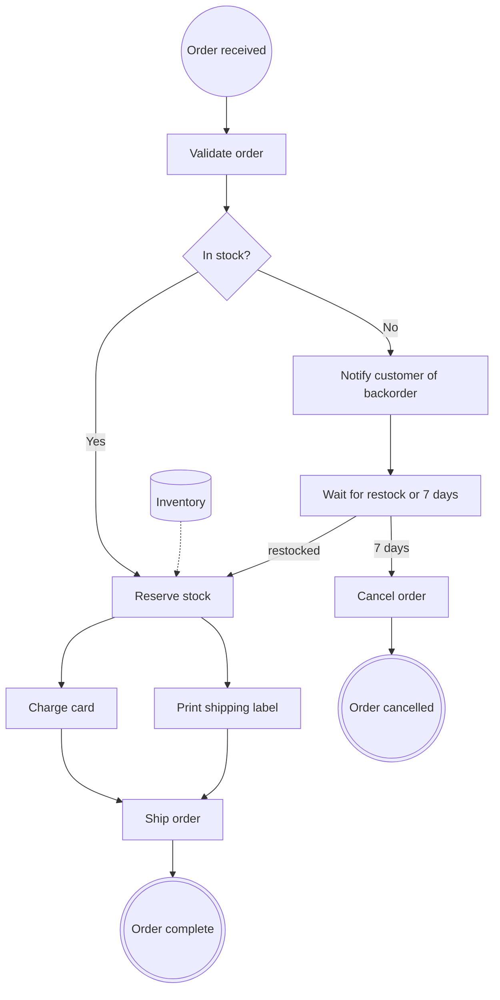
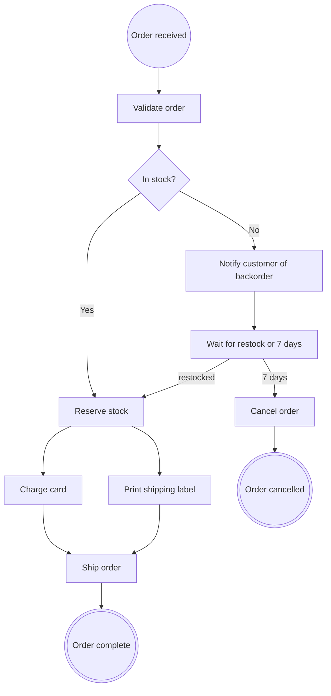

# One diagram, end to end

Eight activities, one drawn gateway, an implied fan-out, an implied join, a merge, a
wait that races an event against a timer, and a data object. Small enough to read in
full and big enough that every phase does something.

## What arrived



Read before extracting:

- **`waitRestock` is a wait, not a task.** Its label opens with "Wait", and its two
  outgoing arrows are labelled with things that *happen* — `restocked`, `7 days` — not
  with things that are *true*. So it is `wait_for_event` with two entries, and the
  arrows become those entries' `next`.
- **`reserve --> charge` and `reserve --> label` are unlabelled, from a rectangle.** Two
  unlabelled arrows out of a non-diamond is an implied parallel fan-out. No `gateway`
  record: it is not drawn.
- **`inventory[(Inventory)]` reaches `reserve` on a dotted arrow.** A `data_object`, and
  **no** edge.
- **One diamond, so one `gateway` record.** `GATEWAY_COUNT` will check that.

## The IR

```jsonl
{"__type": "metadata", "schema_version": "1.0", "diagram_type": "workflow", "complexity": "medium", "truncated": false, "name": "OrderFulfilment", "description": "Validates an order, reserves stock or waits for a restock, then charges and ships it.", "feedback_required": false}
{"__type": "participant", "id": "system", "role": "System", "confidence": "low"}
{"__type": "data_object", "id": "inventory_record", "type": "data_record", "description": "Inventory the reservation draws down", "implicit": false, "confidence": "high"}
{"__type": "start_end_node", "id": "order_received", "type": "start", "description": "Order received", "confidence": "high"}
{"__type": "activity", "id": "validate_order", "type": "task", "task_type": "standard_task", "participant": "system", "description": "Validate order", "data_objects_flow": [], "asynchronous": false, "multi_instance_type": null, "confidence": "high"}
{"__type": "gateway", "id": "gw_in_stock", "type": "exclusive", "role": "diverging", "description": "In stock?", "participant": "system", "flows": [{"condition": "Yes", "condition_label": "stock_available", "is_default": false, "next": "reserve_stock"}, {"condition": "No", "condition_label": "stock_unavailable", "is_default": true, "next": "notify_backorder"}], "data_objects_flow": [], "confidence": "high"}
{"__type": "activity", "id": "notify_backorder", "type": "task", "task_type": "send_task", "participant": "system", "description": "Notify customer of backorder", "data_objects_flow": [], "asynchronous": false, "multi_instance_type": null, "confidence": "high"}
{"__type": "activity", "id": "wait_for_restock", "type": "wait_for_event", "participant": "system", "description": "Wait for a restock notice, or seven days", "data_objects_flow": [], "events": [{"event_type": "message", "name": "Restocked", "event_label": "stock_replenished", "trigger_identifier": "RestockNotice", "next": "reserve_stock"}, {"event_type": "timer", "name": "Seven days elapsed", "event_label": "restock_wait_expired", "trigger_identifier": null, "next": "cancel_order", "event_definition": "P7D"}], "asynchronous": true, "multi_instance_type": null, "confidence": "high"}
{"__type": "activity", "id": "cancel_order", "type": "task", "task_type": "standard_task", "participant": "system", "description": "Cancel order", "data_objects_flow": [], "asynchronous": false, "multi_instance_type": null, "confidence": "high"}
{"__type": "activity", "id": "reserve_stock", "type": "task", "task_type": "service_task", "participant": "system", "description": "Reserve stock", "data_objects_flow": [{"id": "inventory_record", "data_flow": "update"}], "asynchronous": false, "multi_instance_type": null, "confidence": "high"}
{"__type": "activity", "id": "charge_card", "type": "task", "task_type": "service_task", "participant": "system", "description": "Charge card", "data_objects_flow": [], "asynchronous": false, "multi_instance_type": null, "confidence": "high"}
{"__type": "activity", "id": "print_shipping_label", "type": "task", "task_type": "service_task", "participant": "system", "description": "Print shipping label", "data_objects_flow": [], "asynchronous": false, "multi_instance_type": null, "confidence": "high"}
{"__type": "activity", "id": "ship_order", "type": "task", "task_type": "service_task", "participant": "system", "description": "Ship order", "data_objects_flow": [], "asynchronous": false, "multi_instance_type": null, "confidence": "high"}
{"__type": "start_end_node", "id": "order_complete", "type": "end", "description": "Order complete", "confidence": "high"}
{"__type": "start_end_node", "id": "order_cancelled", "type": "end", "description": "Order cancelled", "confidence": "high"}
{"__type": "edge", "from": "order_received", "to": "validate_order", "type": "synchronous", "visual_label": null, "gw_flow_condition": null, "confidence": "high"}
{"__type": "edge", "from": "validate_order", "to": "gw_in_stock", "type": "synchronous", "visual_label": null, "gw_flow_condition": null, "confidence": "high"}
{"__type": "edge", "from": "gw_in_stock", "to": "reserve_stock", "type": "synchronous", "visual_label": null, "gw_flow_condition": "Yes", "confidence": "high"}
{"__type": "edge", "from": "gw_in_stock", "to": "notify_backorder", "type": "synchronous", "visual_label": null, "gw_flow_condition": "No", "confidence": "high"}
{"__type": "edge", "from": "notify_backorder", "to": "wait_for_restock", "type": "synchronous", "visual_label": null, "gw_flow_condition": null, "confidence": "high"}
{"__type": "edge", "from": "wait_for_restock", "to": "reserve_stock", "type": "synchronous", "visual_label": "restocked", "gw_flow_condition": null, "confidence": "high"}
{"__type": "edge", "from": "wait_for_restock", "to": "cancel_order", "type": "synchronous", "visual_label": "7 days", "gw_flow_condition": null, "confidence": "high"}
{"__type": "edge", "from": "cancel_order", "to": "order_cancelled", "type": "synchronous", "visual_label": null, "gw_flow_condition": null, "confidence": "high"}
{"__type": "edge", "from": "reserve_stock", "to": "charge_card", "type": "synchronous", "visual_label": null, "gw_flow_condition": null, "confidence": "high"}
{"__type": "edge", "from": "reserve_stock", "to": "print_shipping_label", "type": "synchronous", "visual_label": null, "gw_flow_condition": null, "confidence": "high"}
{"__type": "edge", "from": "charge_card", "to": "ship_order", "type": "synchronous", "visual_label": null, "gw_flow_condition": null, "confidence": "high"}
{"__type": "edge", "from": "print_shipping_label", "to": "ship_order", "type": "synchronous", "visual_label": null, "gw_flow_condition": null, "confidence": "high"}
{"__type": "edge", "from": "ship_order", "to": "order_complete", "type": "synchronous", "visual_label": null, "gw_flow_condition": null, "confidence": "high"}
{"__type": "result", "success": true, "failed_checks": [], "confidence": "high"}
{"__type": "end_of_ir_stream", "__description": "End of JSON Lines IR output."}
```

Twenty-nine records for thirteen boxes. That ratio is the point: the diagram is the
compressed form and the IR is the expanded one, and the expansion is where the
disagreements become visible.

## Validation, and the two checks that actually did work

`GATEWAY_COUNT`: one diamond, one `gateway`. `LABEL_UNIQUENESS`: `stock_available`,
`stock_unavailable`, `stock_replenished`, `restock_wait_expired` — four, all distinct.
`DATA_OBJECT_USAGE`: `inventory_record` is referenced by `reserve_stock`, which is the
only thing keeping the dotted arrow from vanishing without trace. `DEAD_ENDS`: every
path reaches `order_complete` or `order_cancelled`.

## The connectivity pass

| Node | Edges | Inferred |
| --- | --- | --- |
| `reserve_stock` | 2 out, unlabelled, no gateway record | Parallel fan-out |
| `ship_order` | 2 in, common ancestor `reserve_stock` — a parallel split | Wait for all |
| `reserve_stock` | 2 in, common ancestor `gw_in_stock` — an exclusive split | A merge. **No wait** |
| `wait_for_restock` | 2 out | Not a gateway. The `events` array |

The third row is the one to get right. `reserve_stock` and `ship_order` are the same
shape in the picture — two arrows in — and they mean opposite things. `ship_order` must
wait for both branches; `reserve_stock` must wait for neither, because exactly one of
them will ever arrive and waiting for both deadlocks the run forever. The difference is
only visible from the split, which is why the pass walks back to the ancestor rather
than looking at the join.

## The generated workflow

Python here; the same structure in the other four languages, with their spellings, is in
this skill's language files.

```python
from datetime import timedelta

import dapr.ext.workflow as wf

wfr = wf.WorkflowRuntime()


@wfr.workflow(name="order_fulfilment")
def order_fulfilment(ctx: wf.DaprWorkflowContext, order: dict):
    valid = yield ctx.call_activity(validate_order, input=order)
    if not valid:
        return {"status": "rejected"}

    # gw_in_stock — "In stock?" needs a lookup, so the decision is an activity.
    # This is the one function named after a gateway rather than after a box.
    in_stock = yield ctx.call_activity(evaluate_in_stock, input=order)

    if not in_stock:                                   # stock_unavailable, the default
        yield ctx.call_activity(notify_backorder, input=order)

        # wait_for_restock — a message racing a P7D timer
        restocked = ctx.wait_for_external_event("restocked")
        deadline = ctx.create_timer(timedelta(days=7))
        winner = yield wf.when_any([restocked, deadline])
        if winner is deadline:                         # restock_wait_expired
            yield ctx.call_activity(cancel_order, input=order)
            return {"status": "cancelled"}
        # stock_replenished falls through to the reservation below

    # stock_available, and the restocked path merges in here. No wait: only one
    # of the two branches ever arrives.
    yield ctx.call_activity(reserve_stock, input=order)

    # implied parallel fan-out, and the join at ship_order
    charge = ctx.call_activity(charge_card, input=order)
    label = ctx.call_activity(print_shipping_label, input=order)
    yield wf.when_all([charge, label])

    yield ctx.call_activity(ship_order, input=order)
    return {"status": "shipped"}
```

Every activity gets a body. `charge_card` is the one that needs an idempotency key,
because a retry that charges twice is the failure the user will notice:

```python
@wfr.activity(name="charge_card")
def charge_card(ctx: wf.WorkflowActivityContext, order: dict) -> dict:
    # At-least-once: this can run twice for one logical step. The workflow id plus
    # the activity name is stable across retries and unique across runs.
    idempotency_key = f"{ctx.workflow_id}:charge_card"
    return payments.charge(order["total"], idempotency_key=idempotency_key)
```

## What to hand back

The round trip, rendered from the IR rather than from the input:



It should differ from the input only in the ids, which now match the code. Anything
else that differs is a finding.

Then the honest part:

- **Generated but not drawn:** `evaluate_in_stock`, an activity for the gateway's
  question, because answering it needs an inventory lookup and a lookup cannot sit in
  the orchestrator.
- **Assumed:** the "No" branch is the default. The diagram labelled both arrows, so
  this is a choice, not a reading.
- **Empty bodies to fill in:** all eight activities. `charge_card` has an idempotency
  key wired up and a `payments.charge` call that does not exist yet.
- **Dropped:** nothing. The dotted `Inventory` arrow became `inventory_record` on
  `reserve_stock` rather than an edge.
- **The IR is at** `.workflow.ir.jsonl`.
